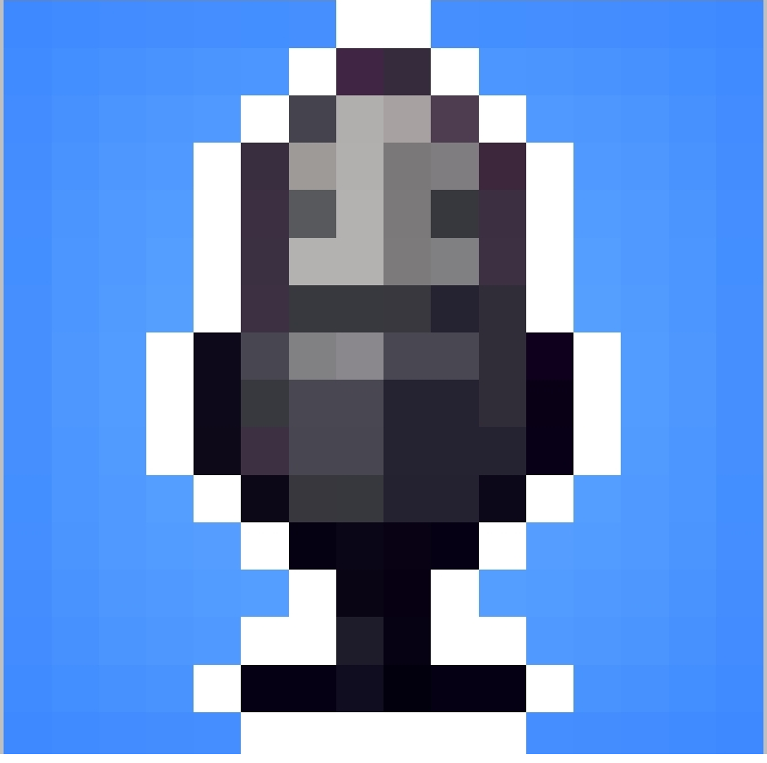

# 🎙️ EnviroVoice

<p align="center">
  
</p>

<p align="center">
  <a href="https://github.com/Halo333X/EnviroVoice/actions/workflows/build.yml">
    
  </a>
  <a href="https://halo333x.github.io/EnviroVoice/">
    
  </a>
  
</p>

A lightweight browser-based **voice chat** app designed for Minecraft (Bedrock Edition) players. Connect with teammates through a voice channel using just your Xbox/Gamertag username and a room URL — no account or install required.

---

## ✨ Features

- 🎮 **Xbox / Minecraft Gamertag** login — no account needed
- 🔗 Connect via **Voice Channel URL**
- 🎤 **Microphone selector** — choose your input device
- 🖥️ **Push to Talk (PTT)** support on desktop — configurable hotkey
- 👥 **Live participants list**
- 🌙 **Dark / Light mode** toggle
- 🕹️ Pixel-art Minecraft-style UI

---

## 🚀 Getting Started

### Option 1 — Live (GitHub Pages)

Visit the deployed app:  
👉 **https://halo333x.github.io/EnviroVoice/**

### Option 2 — Run Locally

```bash
# Clone the repo
git clone https://github.com/Halo333X/EnviroVoice.git
cd EnviroVoice

# Serve with Python
python3 -m http.server 8080
# Open http://localhost:8080
```

> ⚠️ Must be served via HTTP (not opened directly as a file) because microphone access requires a secure context.

---

## 📁 Project Structure

```
EnviroVoice/
├── .github/
│   └── workflows/
│       └── build.yml       # Auto-deploy to GitHub Pages
├── img/
│   ├── icon.png            # App icon (favicon + header)
│   ├── title-light.png     # Logo for light mode
│   ├── title-dark.png      # Logo for dark mode
│   ├── voicechat.png       # Voice chat illustration
│   ├── sun.png             # Light mode toggle icon
│   └── moon.png            # Dark mode toggle icon
├── fonts/
│   ├── 1_Minecraft-Regular.otf
│   └── MinecraftTen-VGORe.ttf
├── index.html              # Main app page
├── script.js               # Core logic (voice, WebRTC, participants)
├── colorMode.js            # Dark/light mode toggle
├── style.css               # Styles
├── version.json            # Version metadata
└── LICENSE                 # MIT License
```

---

## ⚙️ GitHub Pages Setup

1. Push this repo to GitHub
2. Go to **Settings → Pages**
3. Under **Source**, select **GitHub Actions**
4. Push to `main` — the workflow deploys automatically

---

## 📄 License

[MIT](LICENSE) © 2025 Halo333X
